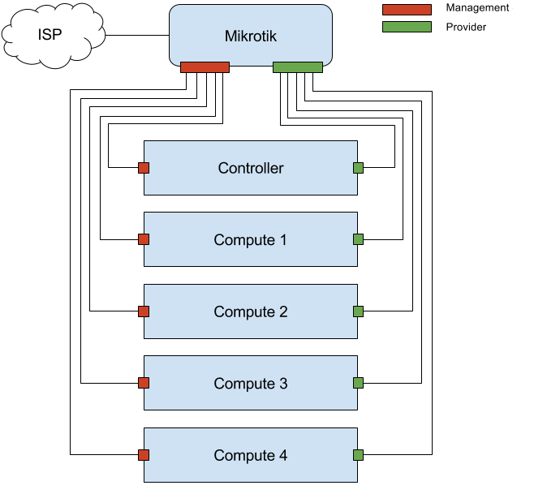

Network Installation
====================

.. contents::
    :local:

Hardware Setup
--------------

This section specifies how to connect the *Mikrotik* router with the *Controller* node and the *Computer* nodes.

1. Place the nodes and router within cabling reach to each other. Mark the cables with
labels to ease troubleshooting of the network.

..  hint:: Mark the cables with syntax such as **Cont-M**, **Cont-P**, **Comp1-M** and **ISP**.

2. Connect the ethernet cables to the MikroTik router in the following manner. Instructions are found below the graphic.

..  note::

    * Connect the management NICs on the controller and compute nodes to the management interfaces (odd numbered interfaces over or equal to three) in the MikroTik.
    * Connect the provider NICs on the controller and compute nodes to the provider interfaces (even numbered interfaces over or equal to three) in the MikroTik.
    * Connect the ether1 interface on the MikroTik to your uplink.

..  note::

    * The ether2 interface is on the management network and can be used for blockstorage or MaaS.

Configuration of MikroTik
-------------------------

..  hint:: Make sure the MikroTik is in factory default configuration first.

The initial IP address for the Mikrotik is 192.168.88.1 / 24. Set the configuration IP to 192.168.88.2 and use
192.168.88.1 as default gateway. Then start the configuration via ssh by using the credentials **admin** and a *blank*
password.

The configuration file is located within ``/resela/install/mikrotik.conf``. Enter that configuration
into the SSH connection and everything should be setup in default format for ReSeLa+.

Remember to set the password for the admin account. This is done using the following command while using a ssh connection:
``/user set [find name=admin] password=$INSERT_ROUTER_PASSWORD_HERE$``

..  hint:: Replace **$INSERT_ROUTER_PASSWORD_HERE$** with the password that the admin account should have in the MikroTik.