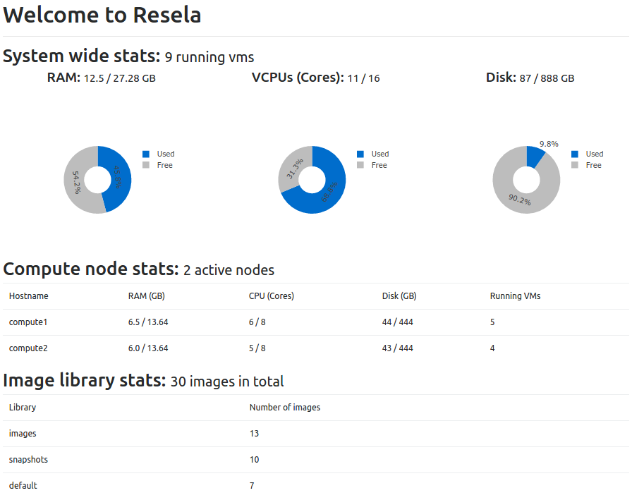
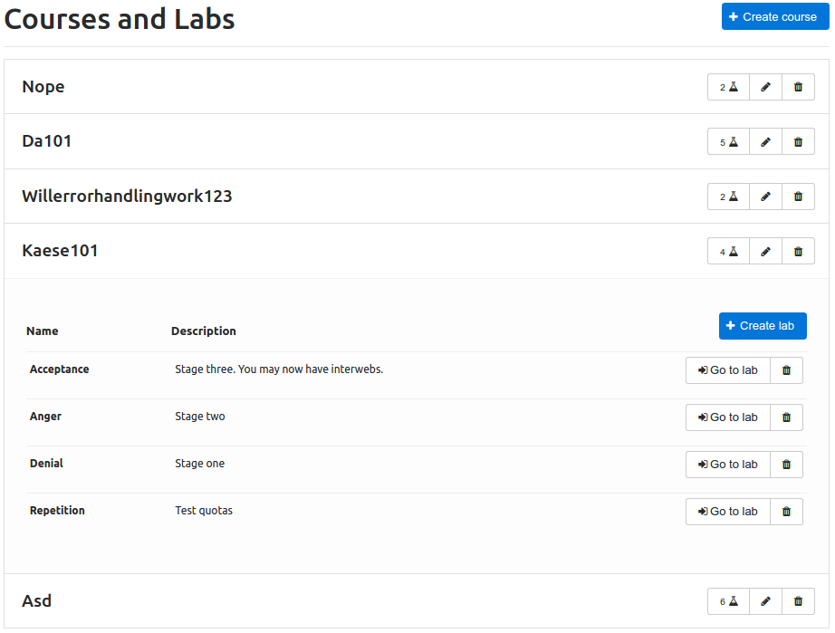
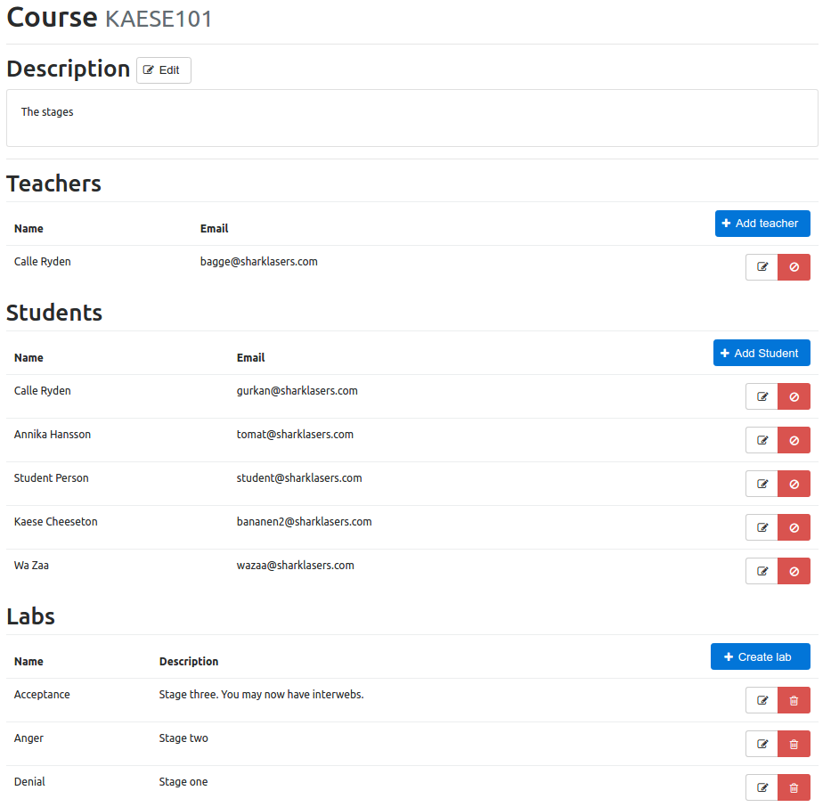
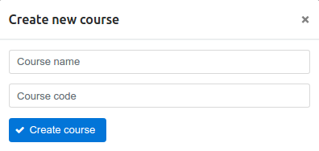
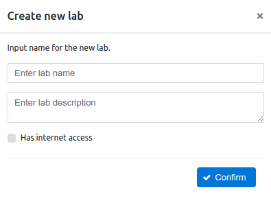
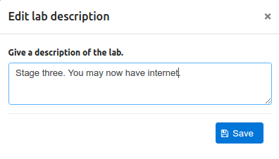
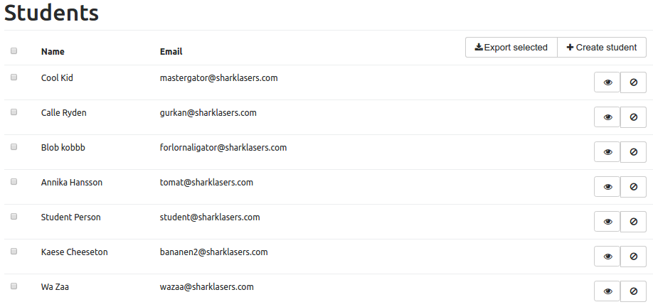
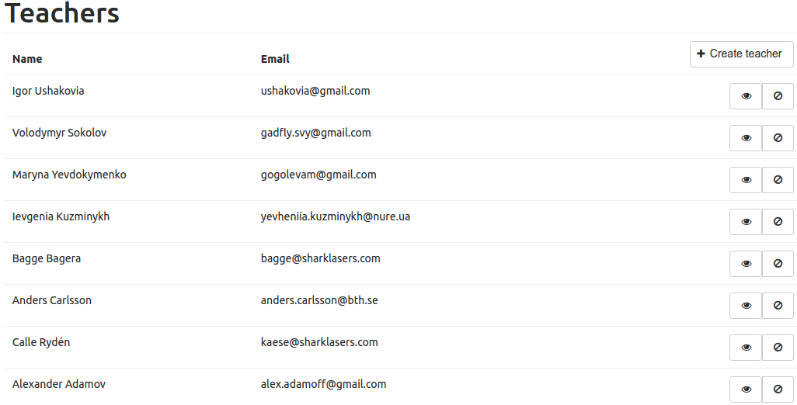
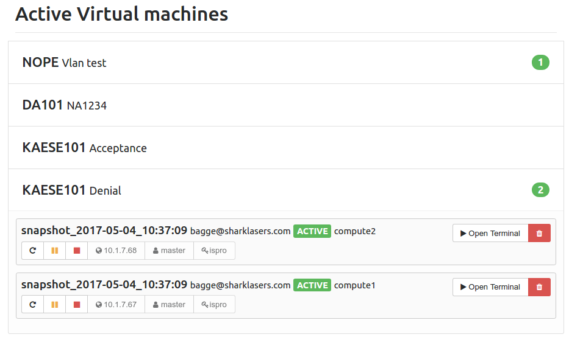

Admin manual
============

.. contents::
    :local:

Admin account
-------------
Admins have access to do almost anything in ReSeLa+. The admin accounts should only be accessible
by the main administrators within your local campus. Admins are the only users that can add
students, teachers and courses to the system. Admin accounts have full vision of the whole
ReSeLa+ application and can see all courses and instances.

Admin accounts needs to be created manually directly in OpenStack.

Settings
--------
In the top menu one can access the setting page by pressing the button **Settings**. In this page
one can change the password by pressing the button **Change password**. When it has been pressed
a popup window will be shown. Here one needs to enter the current password, then enter the new
password twice. To proceed with the password change click on **Save changes**, to cancel click on
**Close** or to close button in the top right corner.

Courses
-------
To handle courses in ReSeLa+, one need to press **Courses** in the admin menu. Once on the course
page, a full list of the courses are visible. For each course shown in the list, one can see the
number of labs the course contains and two buttons. One button to **Edit** the course, the button
with a pen icon, and a second button to **Delete** the course, the button with a trashcan icon.

View course
^^^^^^^^^^^
In the list of courses, one can click on a course to show the labs that a course contains. One
can also see more info about a course by pressing the **Edit** button.

In the course view one can see the description of the course and the enlisted teachers and students
in the course, along with information for each person like name, the email address and the
current VLAN assigned to the user.

Edit course
^^^^^^^^^^^
To edit a course, one need navigate to the course page, find the course that shall be edited and
click the **Edit** button. On the edit page one can edit the description of the course, manage
the enlisted teachers and students and manage the labs of the course.

Edit the description
""""""""""""""""""""
To edit the description of the course, click on the **Edit** button to the right of the title
*Description*. Enter the description of choice and click on **Save** or **Cancel** depending on
the wanted action.

Manage teachers
"""""""""""""""
Below the title *Teachers* all the teachers enlisted to the course is shown. Admins can assign more
teachers to the course by pressing the **Add teacher** button just above the list. In the window
shown enter the email addresses of the teachers that shall be added to the course, separate each
email address added with a semicolon if there's more than one address. Finally to add the
teachers just press the **Confirm** button.

One can also remove teachers from the course by pressing the red **Remove** button on the rightmost
side for each teacher in the list.

Admins has also the option to view and edit information about a teacher, like updating the
name and view all the courses the teacher is assigned to. More on this is explained in the
*Teacher* section further down in the document.

Manage students
"""""""""""""""
Below the title *Students* all the students enlisted to the course is shown. Admins can assign more
students to the course by pressing the **Add students** button just above the list. In the window
shown enter the email addresses of the students that shall be added to the course, separate each
email address added with a semicolon if there's more than one address. Finally to add the
students just press the **Confirm** button.

One can also remove students from the course by pressing the red **Remove** button on the rightmost
side for each student in the list.

Admins has also the option to view and edit information about a student, like updating the
name and view all the courses the student is assigned to. More on this is explained in the
*Student* section further down in the document.

Manage labs
"""""""""""
Below the title *Labs* all the labs within the course is listed. Admins are able to manage labs
for a course, both adding a new lab, remove an existing lab or edit the lab from this list.

To add a new lab one needs to click the **Add lab** button. This will prompt for a lab name, enter
a lab name, try to make this title descriptive so it's easy to understand what the lab is all
about, and click **Confirm** to create the lab. After the lab is created its page is opened
where one can edit the lab, such as the lab description etc. More on this is explained in the
subsection *Edit labs* in the section *Labs* further down in the document.

.. note::
    The lab name has to be unique, ie. no duplicate lab names can be used.

To remove an existing lab one needs to click on the red **Delete Lab** button on the rightmost
side of a lab in the lab list. This will display a confirmation window an by pressing **Confirm**
the lab will be deleted. To cancel the lab deletion just click outside the confirmation window.

To edit an existing lab one needs to click on the **Edit lab** button for the lab one wants to
edit in the lab list. This will open up the edit page of the lab. More on this is explained in
the subsection *Edit labs* in the section *Labs* further down in the document.

Add course
^^^^^^^^^^
By pressing **Add** at the top of the course list, a window will pop up where the admin can enter
the information for a new course. The course name is the name of the course. This should be
descriptive enough for someone to understand what the course is about. The course code should be
the unique identifier of the course used on the current campus. Once the information is put in,
press **Create Course**. If one wants to cancel the course creation just click anywhere outside of
the popup window.

Once a course is added, the edit page of the course will be shown as described in the section
*Edit course* earlier in the document.

Delete course
^^^^^^^^^^^^^
To delete a course from ReSeLa+ the admin needs to find the course in the course list and then
press the **Remove course** button on the rightmost side of a course in the course list, the
button with a trashcan icon. A confirmation window will be displayed and when the **Confirm**
button has been clicked the course is deleted from ReSeLa+. To cancel the course deletion just
click outside of the confirmation window.

Labs
----
All the labs within ReSeLa+ can be found under its respective course in the course page. An admin
can manage the labs of a course in two different ways. Either by clicking on the **Edit** button
for the course as described in the section *Courses* earlier or by directly manage the labs of a
course from the courses page, as will be described here.

To manage the labs one needs to locate the course one wants to edit from the listed courses and
click on that course. This will display all the labs currently existing in the course. The
following sections describes how to add, remove and edit a lab.

Add lab
^^^^^^^
To add a new lab to the selected course click on the **Add lab** just above the lab list.
This will prompt for a lab name, lab description and the internet access of the lab. Enter a lab
name, try to make this title descriptive so it's easy to understand what the lab is all about.
Then enter a description about the lab itself so that one can understand what it's about and
lastly click the checkbox for internet access if the lab should have internet access. Once the
fields has been filled click **Confirm** to create the lab. After the lab is created its page
is opened where one can edit the lab, such as the lab description etc. More on this is explained
in the section *Edit lab*.

.. note::
    The lab name has to be unique, ie. no duplicate lab names can be used.

.. warning::
    The internet access can't be modified once the lab has been created!

Delete lab
^^^^^^^^^^
To remove an existing lab one needs to click on the **Remove Lab** button on the rightmost
side of a lab in the lab list, button with trashcan icon. This will display a confirmation window
and by pressing **Confirm** the lab will be deleted. To cancel the lab deletion just click
outside the confirmation window.

Edit lab
^^^^^^^^
To edit an existing lab one needs to click on the **Edit lab** button for the lab one wants to
edit, that will open the edit page for particular lab. While editing a lab as an admin one can
edit the lab description, lab internet access and remove images from the image list. One can also
see all the active instances in the lab and to some extent modify these.

Edit description
""""""""""""""""
To edit the description of the lab click on the **Edit** button to the right of the lab name.
This will open up a window where the current description can be modified and to save the edit one
needs to click on the **Save** button. To cancel the edit one can click on the button **Cancel**
or click outside of the popup window.

Edit internet access
""""""""""""""""""""
To edit the internet access of the lab click one need to create a new lab. This is due to
security reasons so that no possibly infected instance suddenly have internet access.

Remove images
"""""""""""""
To remove an image from a lab one simple needs to click the **Remove image** button found on the
rightmost side of the image in the image list, button with trashcan icon. This will open up a
confirmation window, to proceed with the image removal click the **Confirm** button. To cancel
the image removal just click anywhere outside the confirmation window.

Manage instances
""""""""""""""""
Under the section *Instances* an admin can see all the instances currently existing within the
lab, these instances can belong to both teachers and students. As an admin one has the
functionality to both *suspend*, *shutdown* and *delete* an instance belonging to another user.
To do this one simply needs to click on the respective button for **Suspend**, **Shutdown** and
**Delete** located on the right side of an instance in the list.

Students
--------
In the Students page an admin can see all the students that has been registered in ReSeLa+. The
students page can be accessed by pressing the **Students** button in the menu. From this page one
can see a list of all the students along with their email addresses and assigned VLANs. From this
page an admin can also add new students, delete existing students, and view/edit information about
students.

Add student
^^^^^^^^^^^
To register a new student in ReSeLa+ an admin needs to click on the button **Create student** at
the top of the student list. Here one needs to enter the student email address, first name and
last name, each separated with a comma. It's also possible to add several students at once by
separating the information about each student with a semi-colon. To complete the creation one has
to press the **Confirm** button, or to cancel the creation click outside the window or click the
close button in the top right corner of the window.

Delete student
^^^^^^^^^^^^^^
At the student page one can delete a specific student by pressing the **Remove user** button
located at the rightmost side of the list for each listed student. When the button has been
pressed a confirmation window appears where one needs to confirm the deletion. To complete the
removal of the user from ReSeLa+ click the **Confirm** button. If one wants to cancel the removal
click the close button in the top right corner or by pressing outside the window.

View student
^^^^^^^^^^^^
By pressing the button **Show user** in the student list an admin can view more information. In
the page that opens up afterwards one can see the same information as at the students page,
name, email address, VLANs, along with some additional information about which courses this
student is enrolled to.

Edit student
^^^^^^^^^^^^
Edit student name
"""""""""""""""""
Admins can edit some things about students such as name and the enlisted courses. To edit a
student one needs to press the **Show user** button to enter the user page for that specific user.
To edit the name of a student one needs to click on the **Update username** button to the right
of the current student name. This will open up a window where one can update the first and last
name and after the edit is complete one just needs to press the **Update** button. To cancel the
edit, click outside the window.

Assign course
"""""""""""""
To add new courses to the student an admin needs to click on the **Assign course** button. This
will open up a window with a drop down list containing all the available courses. Select the
wanted course and click **Assign** to confirm the assignment. To cancel click the close button in
the top right corner or click outside the window.

Remove from course
""""""""""""""""""
To remove a course from a student an admin needs to press the **Remove user from course** button
on the rightmost side of the course in the course list. This will open a confirmation window
where one needs to click the **Confirm** button to complete the action. To cancel click outside
the window or the close button at the top right of the window.

Show course
"""""""""""
An admin can also see information about a course by pressing the **Show course** button for a
course in the list. More information about courses are described in the section *Courses* higher up
in the document.

Teachers
--------
In the teachers page an admin can see all the teachers that has been registered in ReSeLa+. The
teachers page can be accessed by pressing the **Teachers** button in the menu. From this page one
can see a list of all the teachers along with their email addresses and assigned VLANs. From this
page an admin can also add new teachers, delete existing teachers, and view/edit information about
teachers.

Add teacher
^^^^^^^^^^^
To register a new teacher in ReSeLa+ an admin needs to click on the button **Create teacher** at
the top of the teacher list. Here one needs to enter the teacher email address, first name and
last name, each separated with a comma. It's also possible to add several teachers at once by
separating the information about each teacher with a semi-colon. To complete the creation one has
to press the **Confirm** button, or to cancel the creation click outside the window or click the
close button in the top right corner of the window.

Delete teacher
^^^^^^^^^^^^^^
At the teacher page one can delete a specific teacher by pressing the **Remove user** button
located at the rightmost side of the list for each listed teacher. When the button has been
pressed a confirmation window appears where one needs to confirm the deletion. To complete the
removal of the user from ReSeLa+ click the **Confirm** button. If one wants to cancel the removal
click the close button in the top right corner or by pressing outside the window.

View teacher
^^^^^^^^^^^^
By pressing the button **Show teacher** in the teacher list an admin can view more information. In
the page that opens up afterwards one can see the same information as at the teachers page,
name, email address, VLANs, along with some additional information about which courses this
teacher is enrolled to.

Edit teacher
^^^^^^^^^^^^
Edit teacher name
"""""""""""""""""
Admins can edit some things about teachers such as name and the enlisted courses. To edit a
teacher one needs to press the **Show teacher** button to enter the user page for that specific
user. To edit the name of a teacher one needs to click on the **Update username** button to the
right of the current teacher name. This will open up a window where one can update the first and
last name and after the edit is complete one just needs to press the **Update** button. To cancel
the edit, click outside the window.

Assign course
"""""""""""""
To add new courses to the teacher an admin needs to click on the **Assign course** button. This
will open up a window with a drop down list containing all the available courses. Select the
wanted course and click **Assign** to confirm the assignment. To cancel click the close button in
the top right corner or click outside the window.

Remove from course
""""""""""""""""""
To remove a course from a teacher an admin needs to press the **Remove teacher from course** button
on the rightmost side of the course in the course list. This will open a confirmation window
where one needs to click the **Confirm** button to complete the action. To cancel click outside
the window or the close button at the top right of the window.

Show course
"""""""""""
An admin can also see information about a course by pressing the **Show course** button for a
course in the list. More information about courses are described in the section *Courses* higher up
in the document.

Active VMs
----------
By pressing the **Active VMs** button in the menu an admin can see all currently created
instances in ReSeLa+ sorted by the course that each of every instance belongs to. For each of the
instances some information is included such as owner, instance status, its IP address and when it
was created and when it was last used.

An admin has also the ability to suspend and/or delete instances from this page. This can be
done by pressing the **Delete** and **Suspend** buttons.

Image Library
-------------
To get to the image library, press the **Image library** button in the menu. The image library is
the centralised storage and management for all images in ReSeLa+ and is only accessible for admins
and teachers. From this page both teachers and admins can upload new images, search among the
existing ones, view information an image, download images, and also delete images.

.. image:: lib.png

View image info
^^^^^^^^^^^^^^^
Each image is listed with its operating system, operating system version, internet status, size
and what part of the image library that it belongs to, default, snapshots or images.
One can also view the image description, image login credentials and keywords of an image, that one
can use to search for the image, by clicking on the image in the list.

Search for image
^^^^^^^^^^^^^^^^
In the image library one can search for images using the built in search functionality. The
search function is located at the top of the image library page. As standard search one can
search for image using keywords. Just enter the keywords to search after, each of which are
separated with a comma, and press the **Search** button.

To do a more advanced search one needs to click on the **Advanced search** button. This will
expand the search area so that one now can search for image with a certain internet preference,
operating system and version, what part of the image library it should belong to and finally what
flavor it should use.

When the **Search** button has been clicked the image list will be updated so that only the
images that matched the search criterion are shown.

Upload new image
^^^^^^^^^^^^^^^^
Both admins and teachers has the ability to upload new images to the library. The only this that
differs between the two roles is that admins can manage images in the default library, more on
that later.

.. image:: addimage.png

To upload an image one needs to click on the **Upload new** button at the top of the page. After
pressing the button a new popup shows. In this popup one can select the image on the local machine
that should be uploaded, enter the keywords that the image should have, give a description of the
image, enter the login credentials used on the image, select the image operating system and
version, select if the image should have internet access or not and lastly what flavor the image
should have. The image flavor describes how much hardware recourse it should have access to while
running as an instance.

The final selection that one needs to do before uploading is to select what kind of image it is.
*Default* images are meant to be clean standard images that teachers can use in their labs or to
create snapshots from, only an admin has the ability to upload these. An image that's not a
default image should be uploaded as an *Image*, which are regular images that are created from
scratch without using a default image. A *Snapshot* is a modified version of another image
created on a local machine.

.. note::
    The default maximum image size is 25 GB. This can be changed during the installation. Larger
    images than the maximum will be rejected.

Delete image
^^^^^^^^^^^^
Both admins and teachers has the ability can delete images from the library with some exceptions,
admins are the only once that can delete a default image. To delete an image from the library one
needs to press the **Delete** button. This will open up a confirmation window where one needs to
press **OK** to complete the action, to cancel the deletion press **Cancel**.

.. note::
    When deleting an image the image will be unavailable for all admins and teachers to use.

.. note::
    It's not possible to delete an image that's used in a lab or in a teachers snapshot factory.

Download image
^^^^^^^^^^^^^^
Both admins and teachers has the ability to download each image, uploaded to ReSeLa+, to the local
machine. To do this one first needs to click on an image in the list. Once clicked the **Download**
button along with the description, login credentials and keywords are shown. To download an image
one simply needs to click on the **Download** button which will start the download.

Change image format
^^^^^^^^^^^^^^^^^^^
In order for an image to work within OpenStack it has to have one of the following disk formats.

.. note::
    ami,ari,aki,vhd,vmdk,raw,qcow2,vdi,iso,img

If you want to change the disk format you can do so while logged into OpenStack as admin. After
sourcing the credientials and navigating to the path of the image you want to convert, the
following command can be utulized to change a disks format:

.. note::
    qemu-img convert -f raw -O qcow2 image.img image.qcow2

This command will convert a raw image file named **image.img** to a qcow2 image file named **image.qcow2**.
It should be noted that the image you want to convert has to be uploaded manually to OpenStack.

More information about convertion between disk formats can be found on OpenStacks official website https://docs.openstack.org/image-guide/convert-images.html.