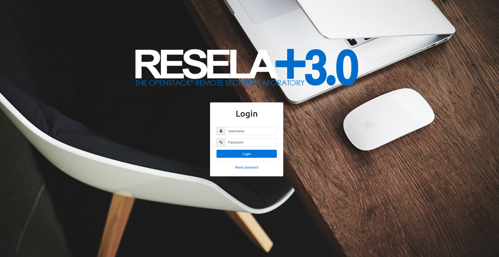
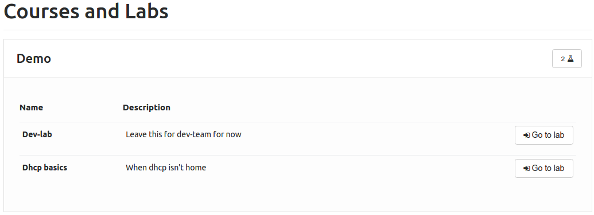
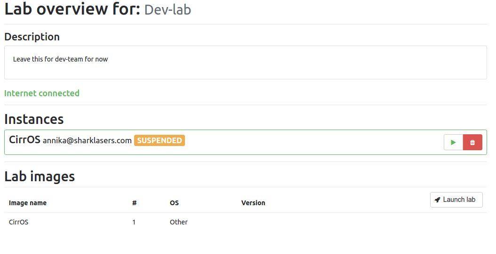

Student manual
==============

.. contents::
    :local:

Acquire an account
------------------
For a student to acquire an account, an admin must enter an email and name into the ReSeLa+
application. Once the information is put into the ReSeLa+ system a random password is generated
and sent to that email address. With that randomized password, it is possible for a user to do
the initial login authentication.

Logging in to the website
-------------------------
Once an account is acquired, a student may enter his or her credentials into the ReSeLa+ web
application. Once authenticated one will be able to start working with labs that exists in the
courses that one has been assigned to.

Settings
--------
In the top menu one can access the setting page by pressing the button **Settings**. In this page
one can change the password by pressing the button **Change password**. When it has been pressed
a popup window will be shown. Here one needs to enter the current password, then enter the new
password twice. Do proceed with the password change click on **Save changes**, to cancel click on
**Close** or to close button in the top right corner.

Courses
-------
By pressing the button **Courses** in the menu a student is able to see all the courses that one
is enrolled to. Each of the courses in the course list shows how many labs it contains in the
rightmost side of the entry.

By clicking on a course entry one can see all the labs that exist in a course. A student can
access a lab by pressing the **Go to lab** button at the rightmost side of the lab. Once the
button has been pressed the page for that specific lab will be opened. See more info about labs
in the section *Labs*.

Labs
----
On the page of a lab a student can see information about the lab as description, if the lab has
internet connection or not and all the instances that one currently has active in the lab. One
can also se the images used in the lab as well as the number of instances one needs of each of
every image in the list.

To launch a lab one must click on the **Launch lab**, this will create/start all the instances
needed in the lab.

.. note::

    Depending on the image size and the number of images needed the launch time will differ greatly.

Once the instances has been created and started there are several options available to manipulate
the instance. After the instance is launched one has the ability to **Start**, **Stop**,
**Resume**, **Shutdown** and **Delete** an instance by pressing the respective buttons. One can
also access the running instance using VNC by clicking on the **Start VNC**, this will allow a
student to access the instance as a regular computer.

Running VMS
-----------

By clicking on the button **Running VMS** a student can see all the instances that one has
created in ReSeLa+. All instances are grouped by the course and lab that they belong to. From this
page one can also manipulate the instances as described in the section *Labs* earlier in the
document.

Access instance using VPN
-------------------------

This setup tutorial assumes a ``ppp`` software installed on the client computer (like
Ubuntu 14 - 16 has). It will also be required to substitute the entire connection with the VPN
connection.

Configuration
~~~~~~~~~~~~~

The VPN preference file (ex. ``/etc/ppp/peers/mpngbr``) should contain:

.. code-block:: none

    pty "pptp <SERVER IP> --nolaunchpppd"
    lock
    noauth
    nobsdcomp
    nodeflate
    name <USERNAME>
    remotename resela
    require-mppe-128
    usepeerdns
    defaultroute
    persist

Some chap secrets are needed (``/etc/ppp/chap-secrets``) to be able to log in on the network:

.. code-block:: none

    $ Secrets for authentication using CHAP
    $ client<TAB>server<TAB>secret<TAB>IP addresses \
    <USERNAME><TAB>resela<TAB><PASSWORD><TAB>*

.. warning::

    It is important that the entries are <TAB> separated.
