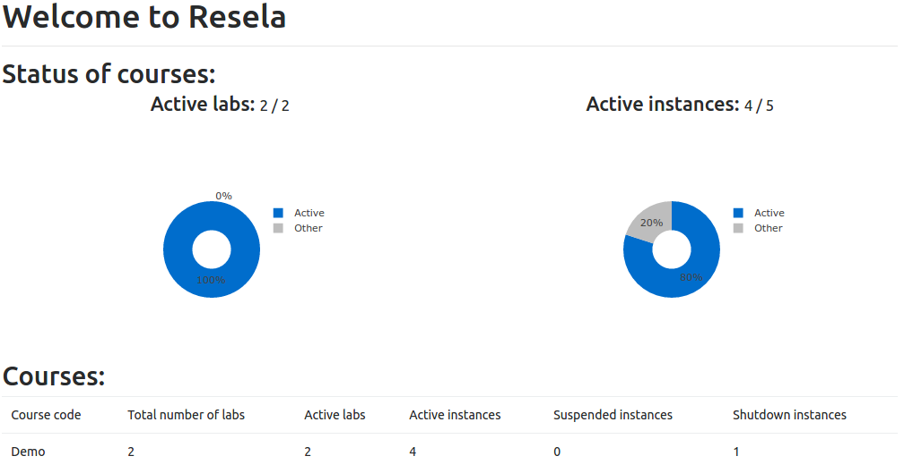
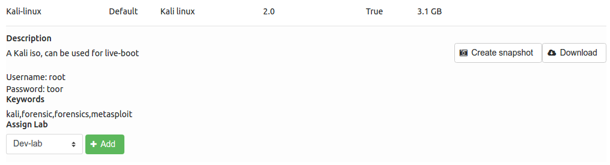
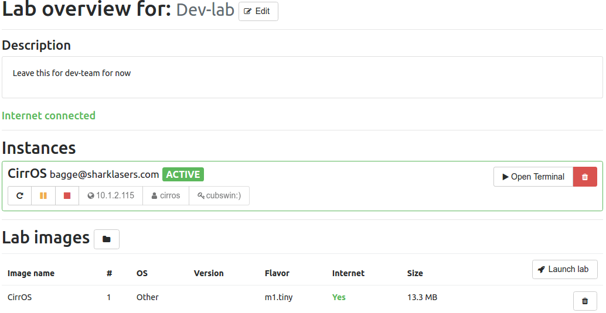
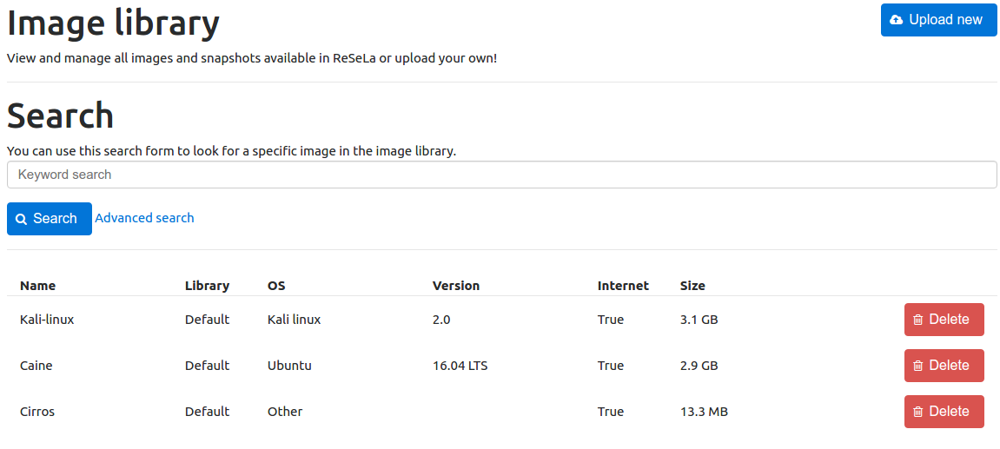
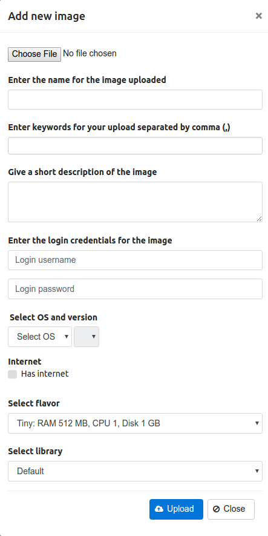
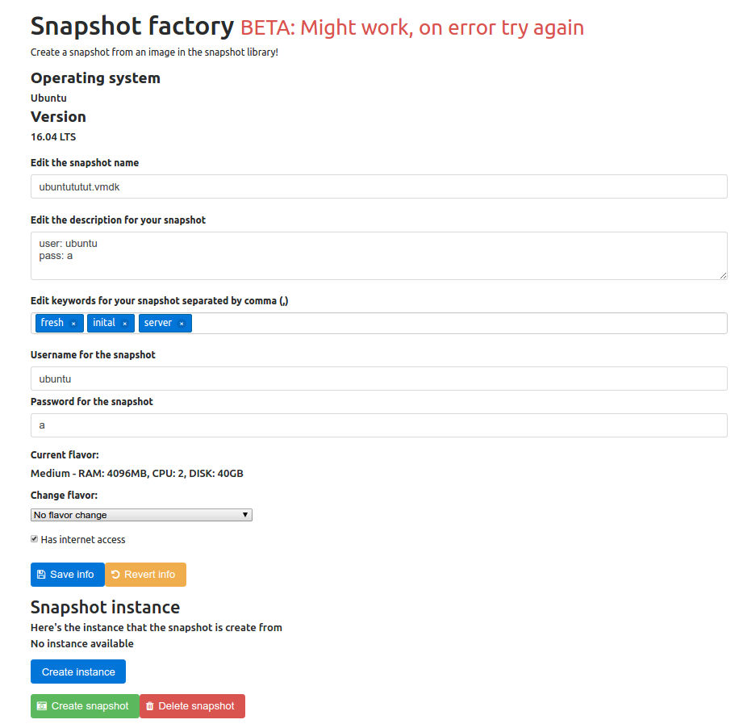

Teacher manual
==============

.. contents::
    :local:

Teacher account
---------------
In ReSeLa+ teachers are somewhere between admins and users when it comes to privileges. Teachers
has the ability to some degree manage enlisted courses and also start instances within a lab.
Teachers has also access to the snapshot factory where one can create a snapshot from an already
existing in the image library.

The first page is is an overview of the current courses and the status of the running instances
for all users in all the courses.

Logout
------

A teacher can log out from the account by pressing **Logout** in the top menu.

Settings
--------
In the top menu, a teacher can access the setting page by pressing the button **Settings**. In this
page the password can be reset by pressing the button **Change password**. When it has been pressed
a popup window will be shown. To change the password the current password has to be entered, then
enter the new password twice. To proceed with the password change click on **Save changes**, to
cancel click on **Close** or to close button in the top right corner.

Feedback
--------

The third link in the top menu is a link to the GitLab on which the project is stored. Here
teachers can see the current progress on the project and give feedback and suggestions. To do
this, the user needs to create an account on GitLab.

Courses
-------

To see all the courses that a teacher is enrolled to one need to press the **Courses** button in
the menu. Once one the course page, a list of all the courses a teacher is enrolled to is shown.
One can see the number of labs the course contains and a button **Edit**, button with a pen icon.

View course
^^^^^^^^^^^

In the list of courses, one can click on a course to show the labs that a course contains. One
can also see more info about a course by pressing the **Edit** button which is a pen.

In the course view one can see the description of the course and the enlisted teachers and students
in the course, along with information for each person like name and the email.

Edit course
^^^^^^^^^^^

To edit a course, one need navigate to the course page, find the course that shall be edited and
click the **Edit** button. On the edit page one can edit the students and manage the labs of the
course.

Manage students
"""""""""""""""

Below the title *Students* all the students enlisted to the course is shown. Teachers can assign
more students to the course by pressing the **Add students** button just above the list. In the
window shown enter the email addresses of the students that shall be added to the course,
separate each email address added with a semicolon if there's more than one address. Finally to
add the students just press the **Confirm** button.

One can also remove students from the course by pressing the red **Remove student** (red stop sign)
button on the rightmost
side for each student in the list.

Manage labs
"""""""""""

Below the title *Labs* all the labs within the course is listed. Teachers are able to manage labs
for a course, both adding a new lab, remove an existing lab or edit the lab from this list.

To add a new lab one needs to click the **Add lab** button. This will prompt for a lab name,  a
description of the lab and if it should have access to internet or not. When the information is
filled in, click **Confirm** to create the lab.
After the lab is created a redirecct will be made to the new lab page where the lab can be edited,
such as the lab description and add images to the lab. More on this is explained in the
subsection *Edit labs* in the section *Labs* further down in the document.

.. note::

    The lab name has to be unique, ie. no duplicate lab names can be used.

To remove an existing lab one needs to click on the red **Delete Lab** (bin) button on the rightmost
side of a lab in the lab list. This will display a confirmation window an by pressing **Confirm**
the lab will be deleted. To cancel the lab deletion just click the X in the upper right corner of
the popup.

To edit an existing lab one needs to click on the **Edit lab** button for the lab one wants to
edit in the lab list. This will open up the edit page of the lab. More on this is explained in
the subsection *Edit labs* in the section *Labs* below.

Labs
----
All the labs that a teacher has access to can be found under each course that one is enrolled to. A
teacher can manage the labs of a course in two different ways. Either by clicking on the **Edit**
button for the course as described in the section *Courses* earlier or by directly manage the
labs of a course from the courses page, as will be described here.

To manage the labs one needs to locate the course one wants to edit from the listed courses and
click on that course. This will display all the labs currently existing in the course. The
following sections describes how to add, remove and edit a lab.

Add lab
^^^^^^^
To add a new lab to the selected course click on the **Add lab** just above the lab list.
This will prompt for a lab name and a lab description, and click **Confirm** to create the lab. After the
lab is created a redirect is made to the new lab page. Here the teacher can edit
description and add images. More on this is explained in the section *Edit lab* below.

.. note::
    The lab name has to be unique, ie. no duplicate lab names can be used.

Delete lab
^^^^^^^^^^
To remove an existing lab one needs to click on the **Remove Lab** (bin) button on the rightmost
side of a lab in the lab list, button with trashcan icon. This will display a confirmation window
and by pressing **Confirm** the lab will be deleted. To cancel the lab deletion just click
outside the confirmation window.

Edit lab
^^^^^^^^
To edit an existing lab one needs to click on the **Edit lab** (pen) button for the lab one wants to
edit, that will open the edit page for particular lab. While editing a lab as a teacher one can
edit the lab description, lab internet access and remove images from the image list. One can also
see ones own instances.

Edit description
""""""""""""""""
To edit the description of the lab click on the **Edit** (pen) button to the right of the lab name.
This will open up a window where the current description can be modified and to save the edit one
needs to click on the **Save** button. To cancel the edit one can click on the button **Cancel**
or click outside of the popup window.

Edit internet access
""""""""""""""""""""
The internet access can not be edited after a lab is created for security reasons. This is to
avoid letting infected images have internet access.

To change the internet access a new lab has to be created with the checkbox ticked or not
depending on if internet access is desired or not.

Add images
""""""""""
To add an image to the lab one needs to access the image library. This can be done either by
clicking on the **Image library** button in the menu or by clicking on the **Add image to lab**
button above the image list in, the button with the folder icon.
To actually add an image to the lab see the subsection *Assign image to lab* in the section *Image
library*.

If an image that are not allowed internet access is added to a lab that has internet access, the
access of the lab will change to no internet access. This is done for security reasons and the
only way to turn the internet access on again is to create a new lab.

Remove images
"""""""""""""
To remove an image from a lab one simple needs to click the **Remove image** button found on the
rightmost side of the image in the image list, button with trashcan icon. This will open up a
confirmation window, to proceed with the image removal click the **Confirm** button. To cancel
the image removal just click anywhere outside the confirmation window.

Manage instances
""""""""""""""""
Under the section *Instances* a teacher can see all their own instances in the lab. A teacher has
one has the functionality to fully manipulate the instances. To do this one simply needs to click
the respective button for **Suspend** (pause button), **Shutdown** (stop button), **Start** (play
button), **Delete** (bin) and **Resume** (rounded arrow). One
can also access an instance using VNC by clicking on the button **Open terminal**.

Running VMs
-----------
On the page running vms a teacher can see all the instances belonging to all participants in the
for his or her courses. All the instances is grouped by the courses and
the lab that each instance belongs to. Each instance contains some information, each displays the
IP address of the instance, the instance status and the instance owner (email address).

In this list a teacher can manage the all the instances by pressing the buttons for the
respective action. The buttons are **Delete** (bin), **Start** (play), **Resume** (rounded arrow),
**Suspend** (pause), **Shutdown** (stop) and
**Open terminal** to start the VNC to that instance.

Image Library
-------------
To get to the image library, press the **Image library** button in the menu. The image library is
the centralised storage and management for all images in ReSeLa+ and is only accessible for admins
and teachers. From this page both teachers and admins can upload new images, search among the
existing ones, view information an image, download images, and also delete images.

View image info
^^^^^^^^^^^^^^^
Each image is listed with its operating system, operating system version, internet status, size
and what part of the image library that it belongs to, default, snapshots or images.
One can also view the image description, image login credentials and keywords of an image, that one
can use to search for the image, by clicking on the image in the list.

Search for image
^^^^^^^^^^^^^^^^
In the image library one can search for images using the built in search functionality. The
search function is located at the top of the image library page. As standard search one can
search for image using keywords. Just enter the keywords to search after, each of which are
separated with a comma, and press the **Search** button.

To do a more advanced search one needs to click on the **Advanced search** button. This will
expand the search area so that one now can search for image with a certain internet preference,
operating system and version, what part of the image library it should belong to and finally what
flavor it should use.

When the **Search** button has been clicked the image list will be updated so that only the
images that matched the search criterion are shown.

Upload new image
^^^^^^^^^^^^^^^^
Both admins and teachers has the ability to upload new images to the library. The only this that
differs between the two roles is that admins can manage images in the default library, more on
that later.

To upload an image one needs to click on the **Upload new** button at the top of the page. After
pressing the button a new popup shows. In this popup one can select the image on the local machine
that should be uploaded, enter the keywords that the image should have, give a description of the
image, enter the login credentials used on the image, select the image operating system and
version, select if the image should have internet access or not and lastly what flavor the image
should have. The image flavor describes how much hardware resource it should have access to while
running as an instance.

The final selection that one needs to do before uploading is to select what kind of image it is.
A regular image that should be uploaded, should be uploaded as an *Image*. A *Snapshot* is a
modified version of another image created on a local machine.

.. note::

    The default maximum image size is 25 GB. This can be changed during the installation. Larger
    images than the maximum will be rejected.

Delete image
^^^^^^^^^^^^
Both admins and teachers has the ability can delete images from the library with some exceptions,
admins are the only once that can delete a default image. To delete an image from the library one
needs to press the **Delete** button. This will open up a confirmation window where one needs to
press **OK** to complete the action, to cancel the deletion press **Cancel**.

.. note::

    When deleting an image the image will be unavailable for all admins and teachers to use.

.. note::

    It's not possible to delete an image that is used in a lab or in a teachers snapshot factory.

Download image
^^^^^^^^^^^^^^
Both admins and teachers has the ability to download each image, uploaded to ReSeLa, to the local
machine. To do this one first needs to click on an image in the list. Once clicked the **Download**
button along with the description, login credentials and keywords are shown. To download an image
one simply needs to click on the **Download** button which will start the download.

Assign image to lab
^^^^^^^^^^^^^^^^^^^
A teacher can assign an image to a lab from which students and other teachers in that course can
create instances from. To do this a one needs to click on the image one wants to assign to a lab
and click on that image entry. There select a lab from the drop down list under the title *Assign
Lab* and then click on the button **Add**. This will add that image to the specified lab and open
up the lab page.

Create snapshot from image
^^^^^^^^^^^^^^^^^^^^^^^^^^
Teachers has the ability to create a snapshot using a web interface in ReSeLa+. To do this one
has to assign an image to use for this. This is done by clicking on an image one wants to use as
base image for the snapshot. When the image has expanded there's a button **Create snapshot** on
the right side. If a teacher clicks on **Create snapshot** the image will be assigned to the
snapshot factory and one will be redirected to the snapshot factory page.

Snapshot factory
----------------
The snapshot factory is the web based snapshot creation functionality in ReSeLa+. To access the
snapshot factory a teacher has to click on the **Snapshot factory** button in the menu. If
there's a base image assigned to the snapshot factory one will have access to the page, otherwise
one will be prompted to go back to the image library to assign an image.

From this page a teacher has the ability to see all the information from the base image and also
the ability to edit the most of information from the base image as well as launching an instance
from the base image so that the image can be altered as wanted.

Edit image information
^^^^^^^^^^^^^^^^^^^^^^
When creating a snapshot one can edit several parts of the base image information. One can change
the description, the keywords, login credentials, the flavor used and the internet access that
the final snapshot should have. Once one has edited some of the information it needs to be saved.
To do this one must click on the **Save info** button.

If one wants to revert all the information that's currently used to the information found in the
base image one can click on the button **Revert info**.

Instance management
^^^^^^^^^^^^^^^^^^^
A teacher can create an instance of the base image using the internet access and flavor currently
saved in the snapshot factory. After the instance is launched one has the ability to **Start**
(play), **Suspend** (pause), **Resume** (rounded arrow), **Shutdown** (stop) and **Delete** (bin) an
instance. One can also access the running
instance using VNC by clicking on the **Open terminal** button.

Create snapshot
^^^^^^^^^^^^^^^
Once there's an instance running a teacher can manipulate the image as much as one wants. When
the instance manipulation is complete one can save the current instance as a snapshot. This is
done by pressing the **Create snapshot** button at the bottom of the page. Once the button has
been pressed the instance is converted to a snapshot, using all the information currently saved
in the snapshot factory, located in the snapshot part of the image library. Once the snapshot has
been created one is redirected to the image library.

.. warning::

    Once the snapshot is successfully created the snapshot factory will be clear from information
    and instances.

Delete snapshot
^^^^^^^^^^^^^^^
If a teacher wants to delete the current snapshot that's being built one can click on the
**Delete snapshot** button located at the bottom of the page. This will clear the snapshot
factory from information and delete the instance if one exists. Once everything has been
successfully cleared a prompt that one must assign an image to the snapshot factory will appear.

Access instance using VPN
^^^^^^^^^^^^^^^^^^^^^^^^^

This setup tutorial assumes a ``ppp`` software installed on the client computer
(like Ubuntu 14 - 16 has). It will also be required to substitute the entire connection with
the VPN connection.

Configuration
^^^^^^^^^^^^^

The VPN preference file (ex. ``/etc/ppp/peers/mpngbr``) should contain:

.. code-block:: none

    pty "pptp <SERVER IP> --nolaunchpppd"
    lock
    noauth
    nobsdcomp
    nodeflate
    name <USERNAME>
    remotename resela
    require-mppe-128
    usepeerdns
    defaultroute
    persist

Some chap secrets are needed (``/etc/ppp/chap-secrets``) to be able to log in on the network:

.. code-block:: none

    $ Secrets for authentication using CHAP
    $ client<TAB>server<TAB>secret<TAB>IP addresses \
    <USERNAME><TAB>resela<TAB><PASSWORD><TAB>*

.. warning::

    It is important that the entries are <TAB> separated.
